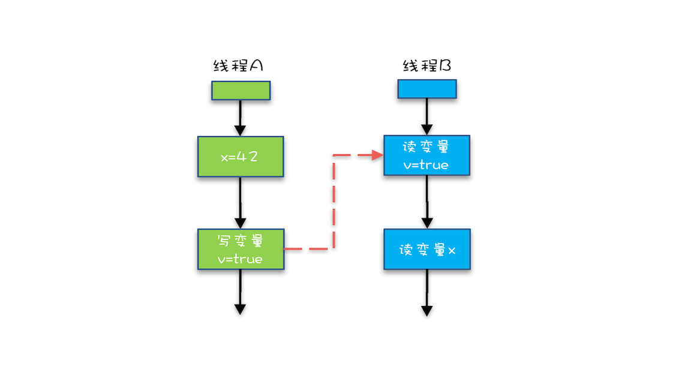

# 02 | Java内存模型：看Java如何解决可见性和有序性问题
<audio src='./02-Java内存模型：看Java如何解决可见性和有序性问题.mp3' controls></audio>
上一期我们讲到在并发场景中，因可见性、原子性、有序性导致的问题常常会违背我们的直觉，从而成为并发编程的Bug之源。这三者在编程领域属于共性问题，所有的编程语言都会遇到，Java在诞生之初就支持多线程，自然也有针对这三者的技术方案，而且在编程语言领域处于领先地位。理解Java解决并发问题的解决方案，对于理解其他语言的解决方案有触类旁通的效果。

那我们就先来聊聊如何解决其中的可见性和有序性导致的问题，这也就引出来了今天的主角—— **Java内存模型**。

Java内存模型这个概念，在职场的很多面试中都会考核到，是一个热门的考点，也是一个人并发水平的具体体现。原因是当并发程序出问题时，需要一行一行地检查代码，这个时候，只有掌握Java内存模型，才能慧眼如炬地发现问题。

## 什么是Java内存模型？

你已经知道，导致可见性的原因是缓存，导致有序性的原因是编译优化，那解决可见性、有序性最直接的办法就是 **禁用缓存和编译优化**，但是这样问题虽然解决了，我们程序的性能可就堪忧了。

合理的方案应该是 **按需禁用缓存以及编译优化**。那么，如何做到“按需禁用”呢？对于并发程序，何时禁用缓存以及编译优化只有程序员知道，那所谓“按需禁用”其实就是指按照程序员的要求来禁用。所以，为了解决可见性和有序性问题，只需要提供给程序员按需禁用缓存和编译优化的方法即可。

Java内存模型是个很复杂的规范，可以从不同的视角来解读，站在我们这些程序员的视角，本质上可以理解为，Java内存模型规范了JVM如何提供按需禁用缓存和编译优化的方法。具体来说，这些方法包括 **volatile**、 **synchronized** 和 **final** 三个关键字，以及六项 **Happens-Before 规则**，这也正是本期的重点内容。

## 使用volatile的困惑

volatile关键字并不是Java语言的特产，古老的C语言里也有，它最原始的意义就是禁用CPU缓存。

例如，我们声明一个volatile变量 `volatile int x = 0`，它表达的是：告诉编译器，对这个变量的读写，不能使用CPU缓存，必须从内存中读取或者写入。这个语义看上去相当明确，但是在实际使用的时候却会带来困惑。

例如下面的示例代码，假设线程A执行writer()方法，按照 volatile 语义，会把变量 “v=true” 写入内存；假设线程B执行reader()方法，同样按照 volatile 语义，线程B会从内存中读取变量v，如果线程B看到 “v == true” 时，那么线程B看到的变量x是多少呢？

直觉上看，应该是42，那实际应该是多少呢？这个要看Java的版本，如果在低于1.5版本上运行，x可能是42，也有可能是0；如果在1.5以上的版本上运行，x就是等于42。

```
// 以下代码来源于【参考1】
class VolatileExample {
  int x = 0;
  volatile boolean v = false;
  public void writer() {
    x = 42;
    v = true;
  }
  public void reader() {
    if (v == true) {
      // 这里x会是多少呢？
    }
  }
}

```

分析一下，为什么1.5以前的版本会出现x = 0的情况呢？我相信你一定想到了，变量x可能被CPU缓存而导致可见性问题。这个问题在1.5版本已经被圆满解决了。Java内存模型在1.5版本对volatile语义进行了增强。怎么增强的呢？答案是一项 Happens-Before 规则。

## Happens-Before 规则

如何理解 Happens-Before 呢？如果望文生义（很多网文也都爱按字面意思翻译成“先行发生”），那就南辕北辙了，Happens-Before 并不是说前面一个操作发生在后续操作的前面，它真正要表达的是： **前面一个操作的结果对后续操作是可见的**。就像有心灵感应的两个人，虽然远隔千里，一个人心之所想，另一个人都看得到。Happens-Before 规则就是要保证线程之间的这种“心灵感应”。所以比较正式的说法是：Happens-Before 约束了编译器的优化行为，虽允许编译器优化，但是要求编译器优化后一定遵守 Happens-Before 规则。

Happens-Before 规则应该是Java内存模型里面最晦涩的内容了，和程序员相关的规则一共有如下六项，都是关于可见性的。

恰好前面示例代码涉及到这六项规则中的前三项，为便于你理解，我也会分析上面的示例代码，来看看规则1、2和3到底该如何理解。至于其他三项，我也会结合其他例子作以说明。

### 1\. 程序的顺序性规则

这条规则是指在一个线程中，按照程序顺序，前面的操作 Happens-Before 于后续的任意操作。这还是比较容易理解的，比如刚才那段示例代码，按照程序的顺序，第6行代码 “x = 42;” Happens-Before 于第7行代码 “v = true;”，这就是规则1的内容，也比较符合单线程里面的思维：程序前面对某个变量的修改一定是对后续操作可见的。

（为方便你查看，我将那段示例代码在这儿再呈现一遍）

```
// 以下代码来源于【参考1】
class VolatileExample {
  int x = 0;
  volatile boolean v = false;
  public void writer() {
    x = 42;
    v = true;
  }
  public void reader() {
    if (v == true) {
      // 这里x会是多少呢？
    }
  }
}

```

### 2\. volatile变量规则

这条规则是指对一个volatile变量的写操作， Happens-Before 于后续对这个volatile变量的读操作。

这个就有点费解了，对一个volatile变量的写操作相对于后续对这个volatile变量的读操作可见，这怎么看都是禁用缓存的意思啊，貌似和1.5版本以前的语义没有变化啊？如果单看这个规则，的确是这样，但是如果我们关联一下规则3，就有点不一样的感觉了。

### 3\. 传递性

这条规则是指如果A Happens-Before B，且B Happens-Before C，那么A Happens-Before C。

我们将规则3的传递性应用到我们的例子中，会发生什么呢？可以看下面这幅图：



示例代码中的传递性规则

从图中，我们可以看到：

1. “x=42” Happens-Before 写变量 “v=true” ，这是规则1的内容；
2. 写变量“v=true” Happens-Before 读变量 “v=true”，这是规则2的内容 。

再根据这个传递性规则，我们得到结果：“x=42” Happens-Before 读变量“v=true”。这意味着什么呢？

如果线程B读到了“v=true”，那么线程A设置的“x=42”对线程B是可见的。也就是说，线程B能看到 “x == 42” ，有没有一种恍然大悟的感觉？这就是1.5版本对volatile语义的增强，这个增强意义重大，1.5版本的并发工具包（java.util.concurrent）就是靠volatile语义来搞定可见性的，这个在后面的内容中会详细介绍。

### 4\. 管程中锁的规则

这条规则是指对一个锁的解锁 Happens-Before 于后续对这个锁的加锁。

要理解这个规则，就首先要了解“管程指的是什么”。 **管程** 是一种通用的同步原语，在Java中指的就是synchronized，synchronized是Java里对管程的实现。

管程中的锁在Java里是隐式实现的，例如下面的代码，在进入同步块之前，会自动加锁，而在代码块执行完会自动释放锁，加锁以及释放锁都是编译器帮我们实现的。

```
synchronized (this) { //此处自动加锁
  // x是共享变量,初始值=10
  if (this.x < 12) {
    this.x = 12;
  }
} //此处自动解锁

```

所以结合规则4——管程中锁的规则，可以这样理解：假设x的初始值是10，线程A执行完代码块后x的值会变成12（执行完自动释放锁），线程B进入代码块时，能够看到线程A对x的写操作，也就是线程B能够看到x==12。这个也是符合我们直觉的，应该不难理解。

### 5\. 线程 start() 规则

这条是关于线程启动的。它是指主线程A启动子线程B后，子线程B能够看到主线程在启动子线程B前的操作。

换句话说就是，如果线程A调用线程B的 start() 方法（即在线程A中启动线程B），那么该start()操作 Happens-Before 于线程B中的任意操作。具体可参考下面示例代码。

```
Thread B = new Thread(()->{
  // 主线程调用B.start()之前
  // 所有对共享变量的修改，此处皆可见
  // 此例中，var==77
});
// 此处对共享变量var修改
var = 77;
// 主线程启动子线程
B.start();

```

### 6\. 线程 join() 规则

这条是关于线程等待的。它是指主线程A等待子线程B完成（主线程A通过调用子线程B的join()方法实现），当子线程B完成后（主线程A中join()方法返回），主线程能够看到子线程的操作。当然所谓的“看到”，指的是对 **共享变量** 的操作。

换句话说就是，如果在线程A中，调用线程B的 join() 并成功返回，那么线程B中的任意操作Happens-Before 于该 join() 操作的返回。具体可参考下面示例代码。

```
Thread B = new Thread(()->{
  // 此处对共享变量var修改
  var = 66;
});
// 例如此处对共享变量修改，
// 则这个修改结果对线程B可见
// 主线程启动子线程
B.start();
B.join()
// 子线程所有对共享变量的修改
// 在主线程调用B.join()之后皆可见
// 此例中，var==66

```

## 被我们忽视的final

前面我们讲volatile为的是禁用缓存以及编译优化，我们再从另外一个方面来看，有没有办法告诉编译器优化得更好一点呢？这个可以有，就是 **final关键字**。

**final修饰变量时，初衷是告诉编译器：这个变量生而不变，可以可劲儿优化。** Java编译器在1.5以前的版本的确优化得很努力，以至于都优化错了。

问题类似于上一期提到的利用双重检查方法创建单例，构造函数的错误重排导致线程可能看到final变量的值会变化。详细的案例可以参考 [这个文档](http://www.cs.umd.edu/~pugh/java/memoryModel/jsr-133-faq.html#finalWrong)。

当然了，在1.5以后Java内存模型对final类型变量的重排进行了约束。现在只要我们提供正确构造函数没有“逸出”，就不会出问题了。

“逸出”有点抽象，我们还是举个例子吧，在下面例子中，在构造函数里面将this赋值给了全局变量global.obj，这就是“逸出”，线程通过global.obj读取x是有可能读到0的。因此我们一定要避免“逸出”。

```
// 以下代码来源于【参考1】
final int x;
// 错误的构造函数
public FinalFieldExample() {
  x = 3;
  y = 4;
  // 此处就是讲this逸出，
  global.obj = this;
}

```

## 总结

Java的内存模型是并发编程领域的一次重要创新，之后C++、C#、Golang等高级语言都开始支持内存模型。Java内存模型里面，最晦涩的部分就是Happens-Before规则了，Happens-Before规则最初是在一篇叫做 **Time, Clocks, and the Ordering of Events in a Distributed System** 的论文中提出来的，在这篇论文中，Happens-Before的语义是一种因果关系。在现实世界里，如果A事件是导致B事件的起因，那么A事件一定是先于（Happens-Before）B事件发生的，这个就是Happens-Before语义的现实理解。

在Java语言里面，Happens-Before的语义本质上是一种可见性，A Happens-Before B 意味着A事件对B事件来说是可见的，无论A事件和B事件是否发生在同一个线程里。例如A事件发生在线程1上，B事件发生在线程2上，Happens-Before规则保证线程2上也能看到A事件的发生。

Java内存模型主要分为两部分，一部分面向你我这种编写并发程序的应用开发人员，另一部分是面向JVM的实现人员的，我们可以重点关注前者，也就是和编写并发程序相关的部分，这部分内容的核心就是Happens-Before规则。相信经过本章的介绍，你应该对这部分内容已经有了深入的认识。

## 课后思考

有一个共享变量 abc，在一个线程里设置了abc的值 `abc=3`，你思考一下，有哪些办法可以让其他线程能够看到 `abc==3`？

欢迎在留言区与我分享你的想法，也欢迎你在留言区记录你的思考过程。感谢阅读，如果你觉得这篇文章对你有帮助的话，也欢迎把它分享给更多的朋友。

## 参考

1. [JSR 133 (Java Memory Model) FAQ](http://www.cs.umd.edu/~pugh/java/memoryModel/jsr-133-faq.html)
2. [Java内存模型FAQ](http://ifeve.com/jmm-faq/)
3. [JSR-133: JavaTM Memory Model and Thread Specification](https://www.cs.umd.edu/~pugh/java/memoryModel/jsr133.pdf)