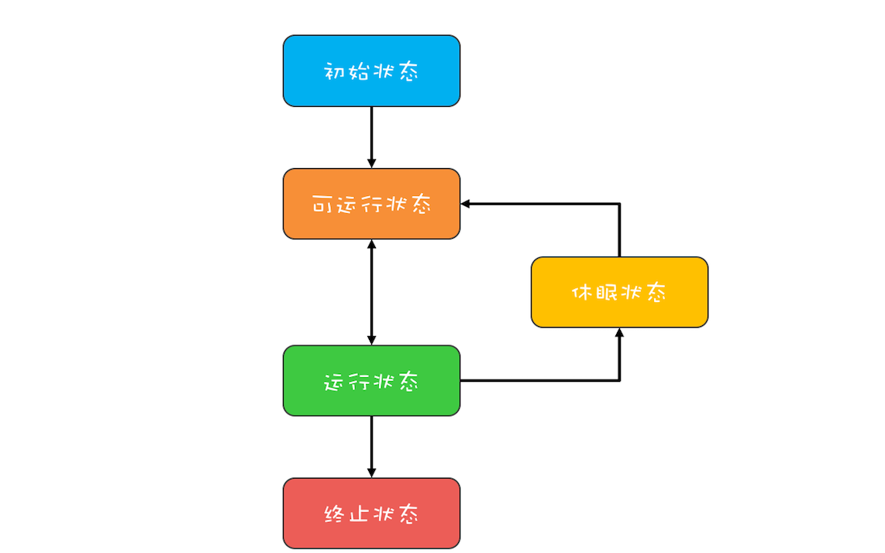
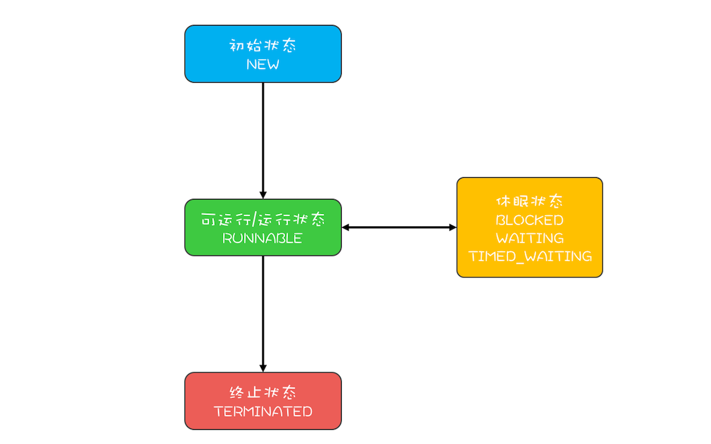
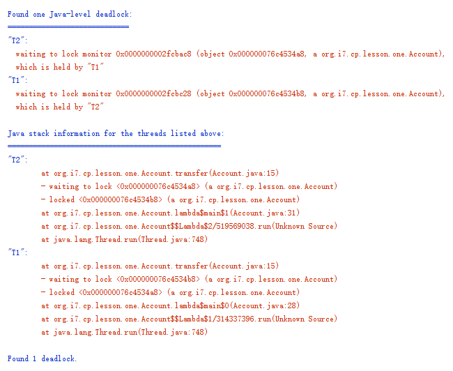

# 09 | Java线程（上）：Java线程的生命周期
<audio src='./09-Java线程（上）：Java线程的生命周期.mp3' controls></audio>
在Java领域，实现并发程序的主要手段就是多线程。线程是操作系统里的一个概念，虽然各种不同的开发语言如Java、C#等都对其进行了封装，但是万变不离操作系统。Java语言里的线程本质上就是操作系统的线程，它们是一一对应的。

在操作系统层面，线程也有“生老病死”，专业的说法叫有生命周期。对于有生命周期的事物，要学好它，思路非常简单，只要能搞懂 **生命周期中各个节点的状态转换机制** 就可以了。

虽然不同的开发语言对于操作系统线程进行了不同的封装，但是对于线程的生命周期这部分，基本上是雷同的。所以，我们可以先来了解一下通用的线程生命周期模型，这部分内容也适用于很多其他编程语言；然后再详细有针对性地学习一下Java中线程的生命周期。

## 通用的线程生命周期

通用的线程生命周期基本上可以用下图这个“五态模型”来描述。这五态分别是： **初始状态、可运行状态、运行状态、休眠状态** 和 **终止状态**。



通用线程状态转换图——五态模型

这“五态模型”的详细情况如下所示。

1. **初始状态**，指的是线程已经被创建，但是还不允许分配CPU执行。这个状态属于编程语言特有的，不过这里所谓的被创建，仅仅是在编程语言层面被创建，而在操作系统层面，真正的线程还没有创建。
2. **可运行状态**，指的是线程可以分配CPU执行。在这种状态下，真正的操作系统线程已经被成功创建了，所以可以分配CPU执行。
3. 当有空闲的CPU时，操作系统会将其分配给一个处于可运行状态的线程，被分配到CPU的线程的状态就转换成了 **运行状态**。
4. 运行状态的线程如果调用一个阻塞的API（例如以阻塞方式读文件）或者等待某个事件（例如条件变量），那么线程的状态就会转换到 **休眠状态**，同时释放CPU使用权，休眠状态的线程永远没有机会获得CPU使用权。当等待的事件出现了，线程就会从休眠状态转换到可运行状态。
5. 线程执行完或者出现异常就会进入 **终止状态**，终止状态的线程不会切换到其他任何状态，进入终止状态也就意味着线程的生命周期结束了。

这五种状态在不同编程语言里会有简化合并。例如，C语言的POSIX Threads规范，就把初始状态和可运行状态合并了；Java语言里则把可运行状态和运行状态合并了，这两个状态在操作系统调度层面有用，而JVM层面不关心这两个状态，因为JVM把线程调度交给操作系统处理了。

除了简化合并，这五种状态也有可能被细化，比如，Java语言里就细化了休眠状态（这个下面我们会详细讲解）。

## Java中线程的生命周期

介绍完通用的线程生命周期模型，想必你已经对线程的“生老病死”有了一个大致的了解。那接下来我们就来详细看看Java语言里的线程生命周期是什么样的。

Java语言中线程共有六种状态，分别是：

1. NEW（初始化状态）
2. RUNNABLE（可运行/运行状态）
3. BLOCKED（阻塞状态）
4. WAITING（无时限等待）
5. TIMED\_WAITING（有时限等待）
6. TERMINATED（终止状态）

这看上去挺复杂的，状态类型也比较多。但其实在操作系统层面，Java线程中的BLOCKED、WAITING、TIMED\_WAITING是一种状态，即前面我们提到的休眠状态。也就是说 **只要Java线程处于这三种状态之一，那么这个线程就永远没有CPU的使用权**。

所以Java线程的生命周期可以简化为下图：



Java中的线程状态转换图

其中，BLOCKED、WAITING、TIMED\_WAITING可以理解为线程导致休眠状态的三种原因。那具体是哪些情形会导致线程从RUNNABLE状态转换到这三种状态呢？而这三种状态又是何时转换回RUNNABLE的呢？以及NEW、TERMINATED和RUNNABLE状态是如何转换的？

### 1\. RUNNABLE与BLOCKED的状态转换

只有一种场景会触发这种转换，就是线程等待synchronized的隐式锁。synchronized修饰的方法、代码块同一时刻只允许一个线程执行，其他线程只能等待，这种情况下，等待的线程就会从RUNNABLE转换到BLOCKED状态。而当等待的线程获得synchronized隐式锁时，就又会从BLOCKED转换到RUNNABLE状态。

如果你熟悉操作系统线程的生命周期的话，可能会有个疑问：线程调用阻塞式API时，是否会转换到BLOCKED状态呢？在操作系统层面，线程是会转换到休眠状态的，但是在JVM层面，Java线程的状态不会发生变化，也就是说Java线程的状态会依然保持RUNNABLE状态。 **JVM层面并不关心操作系统调度相关的状态**，因为在JVM看来，等待CPU使用权（操作系统层面此时处于可执行状态）与等待I/O（操作系统层面此时处于休眠状态）没有区别，都是在等待某个资源，所以都归入了RUNNABLE状态。

而我们平时所谓的Java在调用阻塞式API时，线程会阻塞，指的是操作系统线程的状态，并不是Java线程的状态。

### 2\. RUNNABLE与WAITING的状态转换

总体来说，有三种场景会触发这种转换。

第一种场景，获得synchronized隐式锁的线程，调用无参数的Object.wait()方法。其中，wait()方法我们在上一篇讲解管程的时候已经深入介绍过了，这里就不再赘述。

第二种场景，调用无参数的Thread.join()方法。其中的join()是一种线程同步方法，例如有一个线程对象thread A，当调用A.join()的时候，执行这条语句的线程会等待thread A执行完，而等待中的这个线程，其状态会从RUNNABLE转换到WAITING。当线程thread A执行完，原来等待它的线程又会从WAITING状态转换到RUNNABLE。

第三种场景，调用LockSupport.park()方法。其中的LockSupport对象，也许你有点陌生，其实Java并发包中的锁，都是基于它实现的。调用LockSupport.park()方法，当前线程会阻塞，线程的状态会从RUNNABLE转换到WAITING。调用LockSupport.unpark(Thread thread)可唤醒目标线程，目标线程的状态又会从WAITING状态转换到RUNNABLE。

### 3\. RUNNABLE与TIMED\_WAITING的状态转换

有五种场景会触发这种转换：

1. 调用 **带超时参数** 的Thread.sleep(long millis)方法；
2. 获得synchronized隐式锁的线程，调用 **带超时参数** 的Object.wait(long timeout)方法；
3. 调用 **带超时参数** 的Thread.join(long millis)方法；
4. 调用 **带超时参数** 的LockSupport.parkNanos(Object blocker, long deadline)方法；
5. 调用 **带超时参数** 的LockSupport.parkUntil(long deadline)方法。

这里你会发现TIMED\_WAITING和WAITING状态的区别，仅仅是触发条件多了 **超时参数**。

### 4\. 从NEW到RUNNABLE状态

Java刚创建出来的Thread对象就是NEW状态，而创建Thread对象主要有两种方法。一种是继承Thread对象，重写run()方法。示例代码如下：

```
// 自定义线程对象
class MyThread extends Thread {
  public void run() {
    // 线程需要执行的代码
    ......
  }
}
// 创建线程对象
MyThread myThread = new MyThread();

```

另一种是实现Runnable接口，重写run()方法，并将该实现类作为创建Thread对象的参数。示例代码如下：

```
// 实现Runnable接口
class Runner implements Runnable {
  @Override
  public void run() {
    // 线程需要执行的代码
    ......
  }
}
// 创建线程对象
Thread thread = new Thread(new Runner());

```

NEW状态的线程，不会被操作系统调度，因此不会执行。Java线程要执行，就必须转换到RUNNABLE状态。从NEW状态转换到RUNNABLE状态很简单，只要调用线程对象的start()方法就可以了，示例代码如下：

```
MyThread myThread = new MyThread();
// 从NEW状态转换到RUNNABLE状态
myThread.start()；

```

### 5\. 从RUNNABLE到TERMINATED状态

线程执行完 run() 方法后，会自动转换到TERMINATED状态，当然如果执行run()方法的时候异常抛出，也会导致线程终止。有时候我们需要强制中断run()方法的执行，例如 run()方法访问一个很慢的网络，我们等不下去了，想终止怎么办呢？Java的Thread类里面倒是有个stop()方法，不过已经标记为@Deprecated，所以不建议使用了。正确的姿势其实是调用interrupt()方法。

**那stop()和interrupt()方法的主要区别是什么呢？**

stop()方法会真的杀死线程，不给线程喘息的机会，如果线程持有ReentrantLock锁，被stop()的线程并不会自动调用ReentrantLock的unlock()去释放锁，那其他线程就再也没机会获得ReentrantLock锁，这实在是太危险了。所以该方法就不建议使用了，类似的方法还有suspend() 和 resume()方法，这两个方法同样也都不建议使用了，所以这里也就不多介绍了。

而interrupt()方法就温柔多了，interrupt()方法仅仅是通知线程，线程有机会执行一些后续操作，同时也可以无视这个通知。被interrupt的线程，是怎么收到通知的呢？一种是异常，另一种是主动检测。

当线程A处于WAITING、TIMED\_WAITING状态时，如果其他线程调用线程A的interrupt()方法，会使线程A返回到RUNNABLE状态，同时线程A的代码会触发InterruptedException异常。上面我们提到转换到WAITING、TIMED\_WAITING状态的触发条件，都是调用了类似wait()、join()、sleep()这样的方法，我们看这些方法的签名，发现都会throws InterruptedException这个异常。这个异常的触发条件就是：其他线程调用了该线程的interrupt()方法。

当线程A处于RUNNABLE状态时，并且阻塞在java.nio.channels.InterruptibleChannel上时，如果其他线程调用线程A的interrupt()方法，线程A会触发java.nio.channels.ClosedByInterruptException这个异常；而阻塞在java.nio.channels.Selector上时，如果其他线程调用线程A的interrupt()方法，线程A的java.nio.channels.Selector会立即返回。

上面这两种情况属于被中断的线程通过异常的方式获得了通知。还有一种是主动检测，如果线程处于RUNNABLE状态，并且没有阻塞在某个I/O操作上，例如中断计算圆周率的线程A，这时就得依赖线程A主动检测中断状态了。如果其他线程调用线程A的interrupt()方法，那么线程A可以通过isInterrupted()方法，检测是不是自己被中断了。

## 总结

理解Java线程的各种状态以及生命周期对于诊断多线程Bug非常有帮助，多线程程序很难调试，出了Bug基本上都是靠日志，靠线程dump来跟踪问题，分析线程dump的一个基本功就是分析线程状态，大部分的死锁、饥饿、活锁问题都需要跟踪分析线程的状态。同时，本文介绍的线程生命周期具备很强的通用性，对于学习其他语言的多线程编程也有很大的帮助。

你可以通过 `jstack` 命令或者 `Java VisualVM` 这个可视化工具将JVM所有的线程栈信息导出来，完整的线程栈信息不仅包括线程的当前状态、调用栈，还包括了锁的信息。例如，我曾经写过一个死锁的程序，导出的线程栈明确告诉我发生了死锁，并且将死锁线程的调用栈信息清晰地显示出来了（如下图）。导出线程栈，分析线程状态是诊断并发问题的一个重要工具。



发生死锁的线程栈

## 课后思考

下面代码的本意是当前线程被中断之后，退出 `while(true)`，你觉得这段代码是否正确呢？

```
Thread th = Thread.currentThread();
while(true) {
  if(th.isInterrupted()) {
    break;
  }
  // 省略业务代码无数
  try {
    Thread.sleep(100);
  }catch (InterruptedException e){
    e.printStackTrace();
  }
}

```

欢迎在留言区与我分享你的想法，也欢迎你在留言区记录你的思考过程。感谢阅读，如果你觉得这篇文章对你有帮助的话，也欢迎把它分享给更多的朋友。